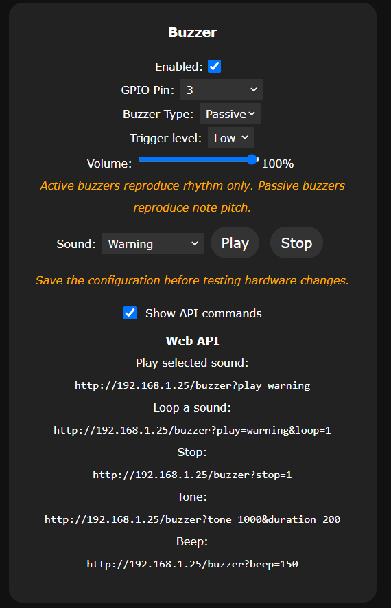

# WLED Buzzer Usermod

Standalone active/passive buzzer service for WLED.

**Release candidate: v0.1.0-rc.8**

## Features

- Active buzzer support using static GPIO output.
- Passive buzzer support using ESP32 LEDC tones.
- Shared High/Low trigger level for active and passive buzzers.
- Passive-buzzer volume control with a 0-100 slider.
- Fully non-blocking sound engine.
- 2 ms `esp_timer` scheduler with mutex-protected WLED-loop fallback if the timer cannot run.
- GPIO and LEDC allocation through WLED `PinManager`.
- Built-in sound registry shared by playback and the configuration UI.
- Sound selector with **Play** and **Stop** controls in Usermod Settings.
- HTTP/Webhook API, WLED JSON API, and reusable C++ service API.
- One-shot, finite-repeat, and infinite-loop playback modes.
- Timing diagnostics through WLED JSON info.

## Built-in sounds

- `beep`
- `double_beep`
- `triple_beep`
- `notification`
- `success`
- `victory`
- `yankee_doodle`
- `fail`
- `star_wars`
- `warning`
- `error`
- `connect`
- `disconnect`
- `attention`
- `alarm`

Passive buzzers reproduce note pitch and timing. Active buzzers ignore pitch and reproduce the timing/rhythm of the same sound definitions.

All 15 built-in sounds have been explicitly validated on real passive-buzzer hardware; basic active-buzzer playback has also been validated on real hardware.

RC8 generalizes the same repeat/loop separation policy to every built-in sound. Each sound has a non-zero final gap that is consumed only when another complete execution follows. One-shot playback therefore ends immediately after the final audible note, while `repeat` and `loop` playback get a deliberate pause between executions.

## Configuration

Open **Config -> Usermods -> Buzzer** and configure:

- **Enabled**
- **GPIO Pin:** GPIO used by the buzzer
- **Buzzer Type:** Active / Passive
- **Trigger level:** High / Low
- **Volume:** 0-100 slider, passive only
- **Sound:** built-in sound used by the Play test control

Save the configuration before testing after changing hardware settings.



## HTTP API

The endpoint is:

```text
GET /buzzer
```

Play once:

```text
GET /buzzer?play=victory
```

Repeat a sound a finite number of times. `repeat` is the **total number of executions** and accepts 1-255:

```text
GET /buzzer?play=alarm&repeat=3
```

Loop indefinitely until explicitly stopped:

```text
GET /buzzer?play=alarm&loop=1
```

Stop playback:

```text
GET /buzzer?stop=1
```

Play a custom tone. Frequency must be **20-20000 Hz** and duration must be **1-60000 ms**:

```text
GET /buzzer?tone=1000&duration=200
```

Play a beep. The `beep` value is the duration in milliseconds (**1-60000 ms**); optional `frequency` must be **20-20000 Hz**:

```text
GET /buzzer?beep=150
GET /buzzer?beep=150&frequency=2000
```

Get the current buzzer status:

```text
GET /buzzer
```

`loop` and `repeat` are mutually exclusive. The HTTP endpoint accepts one command category per request (`stop`, `play`, `tone`, or `beep`). Numeric values are parsed strictly; malformed, signed, or out-of-range values return HTTP 400.

### curl / Bash examples

When an URL contains `&`, quote the whole URL so the shell does not interpret `&` as a background operator:

```bash
curl "http://<WLED-IP>/buzzer?play=alarm&repeat=3"
curl "http://<WLED-IP>/buzzer?play=alarm&loop=1"
curl "http://<WLED-IP>/buzzer?stop=1"
```

Replace `<WLED-IP>` with the IP address or hostname of the WLED device.

## WLED JSON API

Commands can also be sent through the normal WLED `/json/state` endpoint.

Play once:

```json
{"buzzer":{"play":"victory"}}
```

Repeat exactly three times:

```json
{"buzzer":{"play":"alarm","repeat":3}}
```

Loop indefinitely:

```json
{"buzzer":{"play":"alarm","loop":true}}
```

Stop:

```json
{"buzzer":{"stop":true}}
```

Tone:

```json
{"buzzer":{"tone":1000,"duration":200}}
```

Beep:

```json
{"buzzer":{"beep":150,"frequency":2000}}
```

For JSON playback, `repeat` accepts 1-255 and must not be combined with `loop`. An explicitly supplied `repeat: 0`, a value above 255, or a `loop` + `repeat` combination is ignored and does not start playback.

The current state is exposed under `buzzer` in `/json/state`, including `ready`, `playing`, current sound, loop state, remaining repetitions, current note, note count, and current frequency.

## Internal C++ API

Other usermods can include `WLEDBuzzerService.h` and access the singleton service:

```cpp
#include "WLEDBuzzerService.h"

if (WLEDBuzzerService* buzzer = WLEDBuzzerService::instance()) {
  if (buzzer->isReady()) {
    buzzer->play("notification");
  }
}
```

Available playback calls include:

```cpp
buzzer->play("victory");
buzzer->play("alarm", true);       // infinite loop
buzzer->playRepeat("alarm", 3);   // exactly three executions
buzzer->beep(150);
buzzer->tone(1200, 200);
buzzer->stop();
```

Consumers can also query:

```cpp
buzzer->isReady();
buzzer->isPlaying();
buzzer->currentSoundId();
```

The service is out-of-tree and does not require a patch to WLED `const.h` or a reserved core usermod ID.

### Optional consumer bridge

RC8 retains the small `extern "C"` bridge introduced in RC6 for usermods that must compile and link even when the Buzzer Usermod is not part of the firmware. A consumer can weak-link these symbols and detect their presence at runtime without including `WLEDBuzzerService.h`; this avoids PlatformIO LDF pulling the Buzzer repository into builds where it was not selected in `custom_usermods`.

Exported bridge symbols are `wledBuzzerServiceReady()`, `wledBuzzerServicePlaying()`, `wledBuzzerServicePlay()`, `wledBuzzerServiceStop()`, and `wledBuzzerServiceCurrentSoundId()`.

## WLED build integration

Use the repository as an out-of-tree WLED usermod through `custom_usermods`, for example:

```ini
custom_usermods =
  ${env:esp32dev.custom_usermods}
  symlink:///absolute/path/to/wled-usermod-buzzer
```

The repository must be available at the path referenced by the PlatformIO environment.

## Diagnostics

`/json/info` reports:

- usermod version/build;
- `disabled` / `GPIO not configured` / `synchronization unavailable` / `GPIO unavailable` / `not ready` / `idle` / `playing <sound>` state;
- current sound while playing;
- timing source (`esp_timer 2ms` or mutex-protected WLED loop fallback);
- last and maximum scheduler lateness.

`/json/state` reports the live playback state under the `buzzer` object.

## Scope and limitations

- v0.1.0-rc.8 targets ESP32-family WLED builds.
- If the engine mutex cannot be created, playback is disabled rather than exposing an unsafe asynchronous fallback.
- Passive playback requires LEDC resources.
- Active buzzers reproduce rhythm only; they cannot reproduce melody pitch.
- The HTTP endpoint assumes the same trusted-network model as the WLED HTTP interface.
- Built-in sounds are intentionally compact and monophonic.
- The sound registry can be extended without changing the public playback API.

## Source package layout

Release archives use this fixed top-level directory:

```text
wled-usermod-buzzer/
```

This allows update/build scripts to consume subsequent archives without version-specific directory names.

## Release status

This is **v0.1.0-rc.8**. It keeps the validated RC7 runtime behavior and generalizes trailing inter-execution pauses to all built-in sounds. One-shot playback remains audibly unchanged; finite-repeat and infinite-loop playback now always separate complete sound executions. The UI, playback engine, hardware backend, public APIs, sound IDs, note frequencies, note durations, and internal note timing are unchanged.

Before promotion to **v0.1.0**, complete the final target build/hardware regression and the real C++ consumer integration described in `TESTING.md`.
